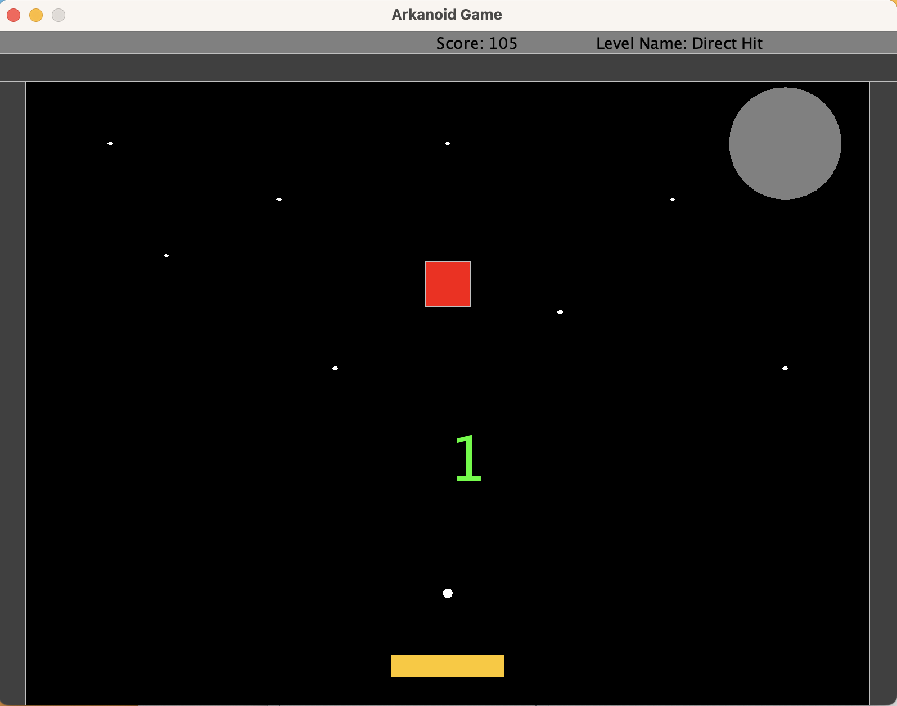
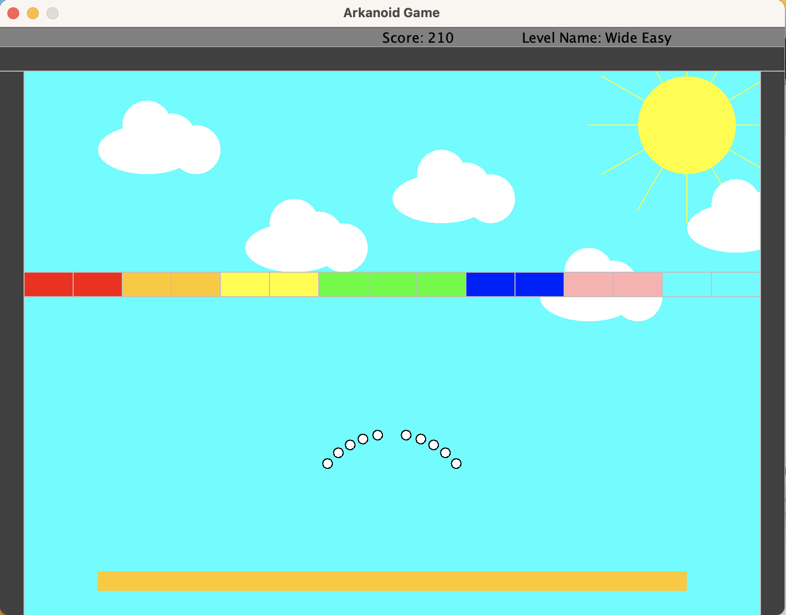
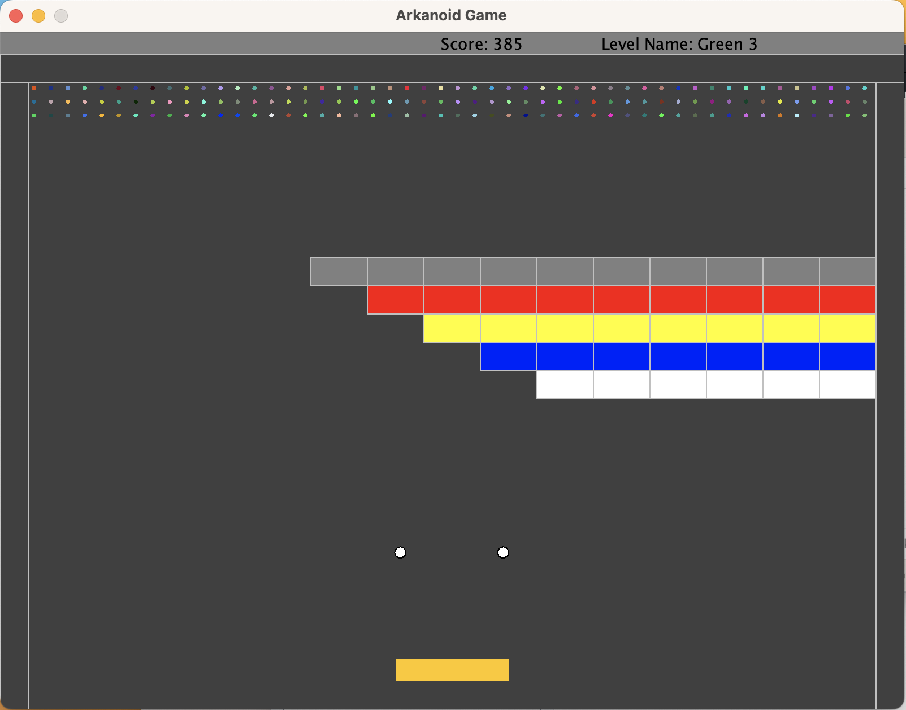

# Arkanoid
Final product of a 5-part-semester project in Java. This project was coded as a five-part ongoing assignment on the 2nd semester of my 1st year at `Bar Ilan University`. 

# Compiling and Running

You must have Java SE 10 or higher installed on your machine. 
You can download the entire source code and run the game via any Java IDEA, if you do be sure to also download the provided *biuoop-1.4.jar* (located [here](./biuoop-1.4.jar)).
Compiling the code should work using the command:

`ant compile`

and running it with (this command will run the default levels order):

`ant run`

if you want to specify the levels of the game it can be done easilly using this (explained below):

`ant -Dargs="levels numbers" run`

# Creating and Editing Levels

This is a special arkanoid game - You get to choose which levels will be played and their order!
The best part is, you don't need to learn how to code to make these changes!

Each level in the game has its own unique characteristics, including:
Name
Background animation
Number of balls
Velocities
Blocks configuration
And more...

To specify the levels you want to play in the game, you can easily use the following command:

`ant -Dargs="levels numbers" run`

For example, to play levels 1, 1 again, 3, and 2 in that order, you would use the following command:

`ant -Dargs="1 1 3 2" run`

# GamePlay

Use the arrow keys on your keyboard to control the paddle.
The paddle has 5 areas that influence the angle at which the ball moves.
Each block you destroy will earn you 5 points, and completing each level rewards you with 100 points.
Pause the game using the p key on your keyboard, and resume by pressing the space key.
To control the paddel use the arraow keys on your keyboard.

# Winning or Losing

You win the game by successfully completing all levels.
You lose if you exhaust all available balls during a level.
Regardless of the outcome, you'll receive a message indicating how many points you've collected throughout the game.

